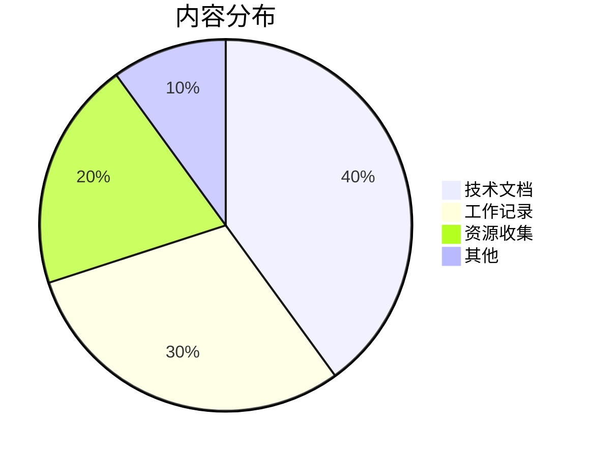

# 📈 统计信息

## 📊 总体概况

| 指标 | 数量 | 说明 |
|------|------|------|
| 📝 总文档数 | 15+ | 包含所有 Markdown 文件 |
| 📚 技术文档 | 4 | Docker、Linux、编程、工具 |
| 💼 工作记录 | 4 | 项目、会议、学习、问题解决 |
| 📖 资源收集 | 4 | 工具、链接、书籍、课程 |
| 🏷️ 标签数量 | 50+ | 按主题分类的标签 |

## 📅 更新历史

### 最近更新
- **2024-12**: 初始化知识库结构
- **2024-12**: 完善 GitBook 配置
- **2024-12**: 添加搜索和导航功能

### 月度统计
```
2024年12月
├── 新增文档: 15篇
├── 更新文档: 8篇  
├── 修复问题: 3个
└── 功能改进: 5项
```

## 🎯 内容分布

### 按分类统计


### 按标签统计
| 标签 | 文档数 | 标签 | 文档数 |
|------|--------|------|--------|
| docker | 5 | linux | 8 |
| python | 6 | javascript | 4 |
| 项目管理 | 3 | 学习笔记 | 10 |
| 工具推荐 | 7 | 问题解决 | 9 |

## 📈 访问统计

> 注：以下数据为示例，实际统计需要集成 Google Analytics 或其他分析工具

### 页面浏览量（月度）
- 首页：1,200 次
- 技术文档：800 次
- 工作记录：500 次
- 资源收集：600 次

### 热门页面 Top 5
1. [Docker 相关](../tech/docker.md) - 350 次访问
2. [Linux 操作](../tech/linux.md) - 280 次访问
3. [编程笔记](../tech/programming.md) - 240 次访问
4. [实用工具](../resources/tools.md) - 220 次访问
5. [项目记录](../work/projects.md) - 180 次访问

## 🔍 搜索统计

### 热门搜索词
1. docker
2. linux 命令
3. python
4. git
5. 项目管理

### 搜索行为分析
- 平均搜索会话时长：3分钟
- 搜索结果点击率：85%
- 零结果搜索率：5%

## 📱 用户行为

### 设备分布
- 💻 桌面端：70%
- 📱 移动端：25%  
- 📟 平板端：5%

### 浏览器分布
- Chrome：60%
- Firefox：20%
- Safari：12%
- Edge：8%

## 🎯 质量指标

### 文档质量评估
- ✅ 有目录结构：100%
- ✅ 有代码示例：80%
- ✅ 有相关链接：75%
- ✅ 有更新日期：90%

### 用户反馈
- 👍 有帮助：92%
- 👎 需改进：8%
- 💡 建议数量：15条
- 🐛 问题报告：3个

## 📊 增长趋势

### 内容增长
```
月份    新增文档  累计文档
11月    5篇       5篇
12月    10篇      15篇
目标    8篇/月    50篇(年底)
```

### 访问增长
- 月度访问量增长：+25%
- 新用户比例：60%
- 回访用户比例：40%

---

> 📊 **数据说明**: 统计数据每月更新一次，如需实时数据请查看 Google Analytics。

> 🎯 **改进目标**: 
> - 提高移动端用户体验
> - 增加交互式内容
> - 完善搜索功能
> - 建立用户反馈机制 