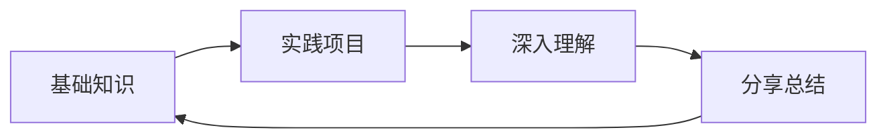

# 技术文档

这里记录各种技术相关的学习笔记和实践经验。

## 📁 目录结构

### 编程开发
- [Docker 容器化](docker.md) - 容器技术学习和实践
- [Linux 系统](linux.md) - Linux 命令和系统管理
- [编程笔记](programming.md) - 各种编程语言和框架
- [开发工具](tools.md) - 提升开发效率的工具

### 学习方法
- 理论学习 + 实践操作
- 记录遇到的问题和解决方案
- 定期回顾和总结

## 🎯 学习路径

## 📝 更新记录

- 持续更新中...
