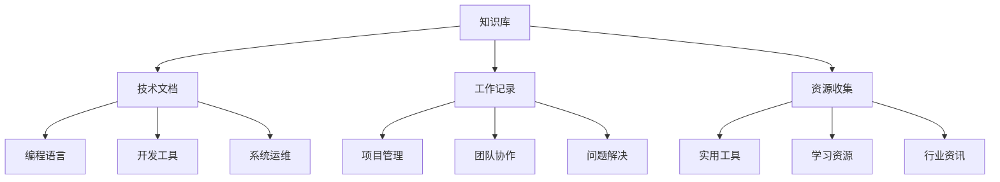

# 欢迎来到我的知识库 📚

这里是我的个人知识库，记录学习笔记、工作经验和有用资源。现在具备完整的GitBook阅读体验！

## ✨ 新增功能

### 🎨 完整的GitBook界面体验
- **📋 左侧导航**: 完整的章节目录结构
- **🔝 顶部工具栏**: 搜索、标题和功能按钮
- **📑 右侧目录**: 当前页面的标题导航
- **📱 响应式设计**: 适配桌面和移动设备

### 🔧 强大的功能特性
- **🔍 智能搜索**: 全文搜索功能
- **📝 在线编辑**: 每页都有"编辑本页"链接
- **💾 代码复制**: 一键复制代码块
- **📊 章节折叠**: 长目录自动折叠
- **⬆️ 返回顶部**: 便捷的页面导航

## 🎯 快速导航

- **[技术文档](docs/tech/)** - 编程、运维、工具使用等技术笔记
- **[工作记录](docs/work/)** - 项目经验、会议纪要、学习计划  
- **[资源收集](docs/resources/)** - 实用工具、参考资料、书籍推荐

## 🔥 最近更新

- 2025-06-15: 初始化知识库
- 2025-06-15: 添加技术文档模板
- 2025-06-15: 配置自动化部署

## 💡 知识体系

## 📈 学习目标

- [ ] 系统整理技术知识点
- [ ] 建立完整的学习路径
- [ ] 沉淀项目实战经验
- [ ] 构建个人知识图谱

---

> 💭 **座右铭**: 学而时习之，不亦说乎？
